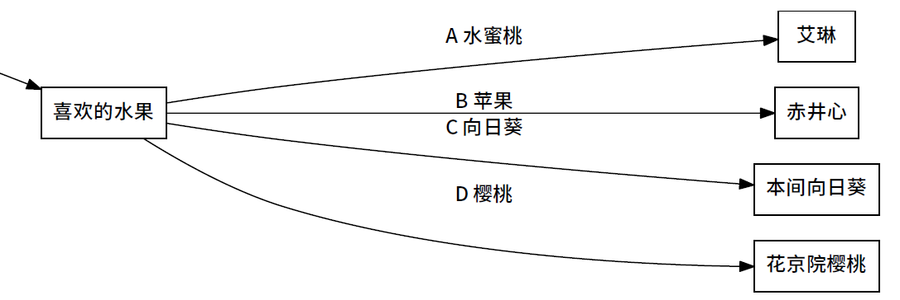

<h1 align="center">⚠ bili-interactive-spoiler ⚠</h1>
<p align="center">
  
  <a href="https://twitter.com/Miracle_XYZ">
    
  </a>
</p>

> 哔哩哔哩互动视频剧透工具
> 
> **[剧透警告] 不要滥用！滥用行为造成的后果我们概不负责。**
> 
> Click [here](README.md) for English version.

## 安装

### Python库

```sh
pip install -r requirements.txt
```

### Graphviz

确保你的电脑上安装了 Graphviz 并放在了你的 `PATH` 环境变量下。

## 使用

### config.py

按照实际情况修改 `config.py` ，参数说明如下：

- `aid`: 视频av号
- `graph_version`: 图表版本号
- `fontname`: 字体名称（这里是「思源黑体」，可以改为其他的中文字体名称）
- `output`: 输出文件名（以'.gv'结尾）
- `layout`: 布局：'horizontal'（横向）, 'edge'（纵向，选项在边上表示）

其中 `graph_version` 获取方法如下：

1. 打开视频网页，按下 `F12` 打开开发者工具，切换到 `Network` 选项卡。
2. 在 `Filter` 文本框中输入 `nodeinfo`。
3. 按下 `F5` 刷新网页，等待网页加载。
4. 列表中出现内容时，右键单击出现的第一个网址，选择 `Copy > Copy link address`。
5. 把链接粘贴到文本编辑器中。找到连接中 `graph_version=...&` 这部分内容，并将 `...` 所代表的数字复制下来。这就是 `graph_version`。

### main.py

```sh
python main.py
```

执行完毕后，生成的结果将会出现在同一文件夹下。（包括 `gv` 和 `pdf` 文件）


## 效果

<details>
  <summary>点击查看效果（剧透慎点）</summary>

  
</details>


## 作者

👤 **MiracleXYZ**

* Twitter: [@Miracle_XYZ](https://twitter.com/Miracle_XYZ)
* Github: [@MiracleXYZ](https://github.com/MiracleXYZ)

## 支持

觉得好用就赏个⭐️吧~

***
_This README was generated with ❤️ by [readme-md-generator](https://github.com/kefranabg/readme-md-generator)_